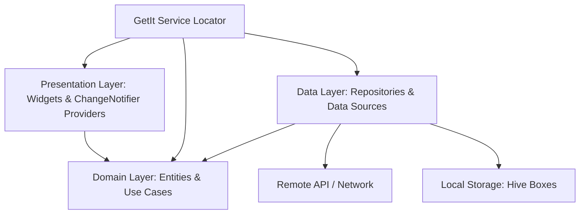

<div align="center">

  

  # **دوا — DUA**
  ### **Smart Medical & Drug Information Assistant**

  <p align="center">
    <strong>دليلك الدوائي الشامل والذكي لمعرفة أسعار الأدوية، المواد الفعالة، والبدائل المتاحة</strong>
  </p>

  <p align="center">
    <a href="https://github.com/MOELSHAFEY/Dua-application/releases"></a>
    <a href="https://flutter.dev"></a>
    <a href="https://pub.dev/packages/provider"></a>
    <a href="https://github.com/MOELSHAFEY/Dua-application/blob/main/LICENSE"></a>
  </p>

  <p align="center">
    <a href="#-features">Key Features</a> •
    <a href="#-architecture">Clean Architecture</a> •
    <a href="#-design--theming">Design & Themes</a> •
    <a href="#-getting-started">Getting Started</a> •
    <a href="#-developer">Developer</a>
  </p>

  ---

</div>

<br />

## 🌟 Overview

**DUA (دوا)** is a modern, human-crafted Flutter application engineered to provide patients, pharmacists, and medical professionals across Egypt with rapid, dependable, and offline-resilient access to pharmaceutical information, verified prices, active ingredients, and alternatives.

Built from the ground up using **Clean Architecture** and **Provider-only state management**, DUA delivers instantaneous searches, accessibility controls, offline persistence via Hive, and a sleek dual-mode medical palette.

---

## ✨ Features

<table>
  <tr>
    <td width="50%">
      <h3>🔍 Instant Debounced Search</h3>
      <p>Instantaneous results triggered automatically 300ms after typing stops, featuring dynamic search keyword highlighting in drug names.</p>
    </td>
    <td width="50%">
      <h3>🌓 Complete Dual Theme</h3>
      <p>Flawless transition between a crisp Slate Light theme and a deep OLED-friendly Dark theme (Slate-900 / Emerald-400).</p>
    </td>
  </tr>
  <tr>
    <td width="50%">
      <h3>♿ Accessibility & Font Scaling</h3>
      <p>In-app font size controls (Normal 1.0x / Large 1.25x) specifically designed for elderly patients and comfortable reading.</p>
    </td>
    <td width="50%">
      <h3>❤️ Quick Swipe-to-Favorite</h3>
      <p>Swipe right on any drug card to instantly save or remove from local favorites with tactile haptic feedback.</p>
    </td>
  </tr>
  <tr>
    <td width="50%">
      <h3>⚡ Smart Launch (< 150ms)</h3>
      <p>Bypasses initial splash delays on warm starts if access verification was completed in the last 24 hours.</p>
    </td>
    <td width="50%">
      <h3>🛡️ Offline Resilience Banner</h3>
      <p>Gracefully alerts the user when offline with a one-tap shortcut to view offline-cached Favorites.</p>
    </td>
  </tr>
  <tr>
    <td width="50%">
      <h3>🎙️ Voice Search Integration</h3>
      <p>Speech-to-text recognition allowing effortless hands-free medication searches.</p>
    </td>
    <td width="50%">
      <h3>📸 Smart Share Cards</h3>
      <p>Export and share medication cards with full active ingredient details and pricing directly to WhatsApp or doctors.</p>
    </td>
  </tr>
</table>

---

## 🏗️ Architecture

DUA strictly adheres to **Clean Architecture** with feature-driven modularity:

```
lib/
├── core/                       # Core abstractions, DI, themes, and shared widgets
│   ├── di/                     # Dependency Injection with GetIt
│   ├── entities/               # Core domain entities (Drug)
│   ├── network/                # ApiClient & HTTP handlers
│   ├── services/               # VoiceSearchService
│   ├── theme/                  # AppColors & AppThemes (Dual Mode)
│   └── widgets/                # EnhancedDrugCard, CustomLoader, EmptyStateWidget, Shimmer
└── features/                   # Feature Modules (Clean Architecture)
    ├── access_control/         # Security, remote version validation, and update handling
    ├── app_info/               # Application information, developer details, and contacts
    ├── drug_details/           # Drug details, zoomable images, dosage, and sharing
    ├── drug_search/            # Debounced search, voice search, history chips, home
    ├── favorites/              # Hive-backed offline favorites management
    ├── settings/               # Dark/Light theme, font scaling, and access caching
    └── splash/                 # Smart launch & branding
```



---

## 🎨 Design & Theming

Designed with human-crafted proportions, high-contrast Cairo typography, and subtle micro-elevations:

- **Light Mode**: Crisp Slate-50 background (`#F8FAFC`), pure white surfaces (`#FFFFFF`), Slate-200 borders (`#E2E8F0`), and Emerald-600 price tags (`#059669`).
- **Dark Mode**: Deep Slate-900 background (`#0F172A`), Slate-800 surfaces (`#1E293B`), Slate-700 borders (`#334155`), and luminous Emerald-400 price tags (`#34D399`).

---

## 🛠️ Technical Stack

| Category | Technology |
| :--- | :--- |
| **Framework** | [Flutter](https://flutter.dev/) (v3.7.2+) |
| **State Management** | [Provider](https://pub.dev/packages/provider) (^6.1.5) |
| **Local Database** | [Hive Flutter](https://pub.dev/packages/hive_flutter) (^1.1.0) |
| **Dependency Injection** | [GetIt](https://pub.dev/packages/get_it) (^9.2.1) |
| **Functional Programming** | [Dartz](https://pub.dev/packages/dartz) (^0.10.1) |
| **Voice Recognition** | [Speech to Text](https://pub.dev/packages/speech_to_text) (^7.0.0) |
| **Sharing & Screenshots** | [Share Plus](https://pub.dev/packages/share_plus) & [Screenshot](https://pub.dev/packages/screenshot) |
| **Typography** | [Google Fonts](https://pub.dev/packages/google_fonts) (Cairo) |

---

## 🚀 Getting Started

### Prerequisites
- Flutter SDK `^3.7.2` or higher
- Dart SDK `^3.7.2` or higher
- Android Studio / VS Code with Flutter extension

### Installation

1. **Clone the repository:**
   ```bash
   git clone https://github.com/MOELSHAFEY/Dua-application.git
   cd Dua-application
   ```

2. **Install dependencies:**
   ```bash
   flutter pub get
   ```

3. **Run Static Analysis & Tests:**
   ```bash
   flutter analyze
   flutter test
   ```

4. **Run on Device or Emulator:**
   ```bash
   flutter run
   ```

5. **Build Release APK:**
   ```bash
   flutter build apk --release
   ```

---

## 👨‍💻 Developer

**Mohamed Elshafey (MOELSHAFEY)**  
- **GitHub**: [@MOELSHAFEY](https://github.com/MOELSHAFEY)
- **Telegram**: [@MO_SH_FY](https://t.me/MO_SH_FY)
- **Repository**: [Dua-application](https://github.com/MOELSHAFEY/Dua-application)

---

## 📄 License

This project is licensed under the **MIT License** — see the [LICENSE](LICENSE) file for details.

<div align="center">
  <sub>Built with ❤️ for patients and healthcare professionals in Egypt • © 2026 MOELSHAFEY</sub>
</div>
